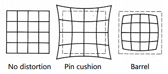

## Geometry

+ **Singular Value decomposition(SVD)**
	- a factorization of a normal matrix, extended from eigendecomposition.
	- $A_{n \times m} = U_{n \times n}\Sigma_{n \times m}V^T_{m \times m}$
		+ $(A^TA)v_i = \lambda_iv_i$
		+ **singular values **$\sigma_i = \sqrt{\lambda_i}$
		+ $u_i=\frac{1}{\sigma_i}Av_i$
	- One can easily verify that the square matrix also satisfies this definition(the same as eigendecomposition).
	- $U,V$ are orthogonal matrices
	- Usually we set $r \in (0,rk(A)]$ to approximate SVD.
		

+ **Transfomation in 2D**
	- Rotation+Scaling+Translation
		
    - Affinities
    	

+ **Camera Calibration**
	- intrinsic parameters
		+ Simply use similar triangle to find the fomula:
			
        + Because the point is not exactly at the center, we should add shift parameters $c_x$ and $c_y$, totally $4$ parameters.
        + Use the trick of **Homogeneous Coordinates**, finally:
        	
    - extrinsic parameters
    	+ rotattion and translation
    	+ $6$ parameters: $(\theta, \phi, \psi, c_x, c_y, c_z)$
    - distortion parameters
    	+ Radial distortion
    		
            
        + Tangential distortion
        	
            
        + $5$ parameters: $(k1,k2,k3,p1,p2)$
    - Camera Calibration
    	+ To find above parameters
    		

## Low & Mid-level vision

## High level vision