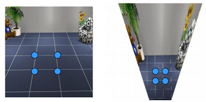
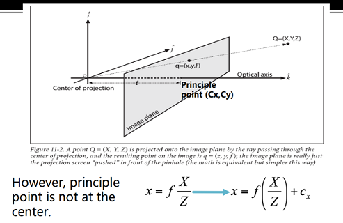

## Singular Value decomposition(SVD)
- a factorization of a normal matrix, extended from eigendecomposition.
- $A_{n \times m} = U_{n \times n}\Sigma_{n \times m}V^T_{m \times m}$
    + $(A^TA)v_i = \lambda_iv_i$
    + **singular values**: $\sigma_i = \sqrt{\lambda_i}$
    + $u_i=\frac{1}{\sigma_i}Av_i$
- One can easily verify that the square matrix also satisfies this definition(the same as eigendecomposition).
- $U,V$ are orthogonal matrices
- Usually we set $r \in (0,rk(A)]$ to approximate SVD.
    

## Transfomation in 2D

|Name|Function|Preserve|DOF|
|----|--------|--------|---|
|Isometries|rotation, translation|distance|$3$|
|Similarities|[above], scale|ratio of lengths, angles|$4$|
|Affinities||parallel lines, ratio of areas and lengths|$6$|
|Projective||cross ratio of 4 collinear points, collinearity|$8$|

- **Rotation+Scaling+Translation**

    

- **Affinities**

    

- **Projective**

    

## Projective

- $x=PX,x'=P'X$ How to change $x$ to $x'$?
- In 2D perspective, $x'=Hx$. However, due to projective transformation, they are in 3D Homogeneous Coordinates and $x' \times Hx = 0$, where $\times $ means cross product.
- Rewrite $9$ parameters from $H$ in a column vector $h$. For one pair of points, it can be derived that $A_{3\times9}h_{9 \times 1}=0$. Note that although there are $3$ equations, only $2$ of them are independent. So finally we can acquire that $A_{2N\times9}\cdot h=0$
- Use SVD to solve this equation: $A=U_{2N\times9}\Sigma_{9\times9}V^T_{9\times9}$. **$h$ is is the last column of $V^T$.**

## Camera Model

+ **Pinhole camera**

    - Because the point is not exactly at the center, we should add shift parameters $c_x$ and $c_y$. So that $x'=f_xx+c_x, y'=f_yy+c_y$.

        
	- Why the aperture cannot be too small?
		+ Less light passes through
		+ Diffraction effect

+ Lenses
	- For thin lense:

		

## Camera Calibration
- **intrinsic parameters**
    + From Pinhole Camera Model, totally $4$ parameters. Use the trick of **Homogeneous Coordinates**, finally:

        
- **extrinsic parameters**
    + rotattion and translation
    + $6$ parameters: $(\theta, \phi, \psi, c_x, c_y, c_z)$
- **distortion parameters**
    + Radial distortion

        

        
    + Tangential distortion

        

        
    + $5$ parameters: $(k1,k2,k3,p1,p2)$
- **Camera Calibration**
    + To find above parameters

        
